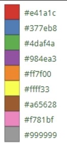
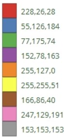

[Matplotlib: beautiful plots with style](http://www.futurile.net/2016/02/27/matplotlib-beautiful-plots-with-style/)

```python
colormap = plt.get_cmap('viridis')
```

[Viridis Palette Generator](https://waldyrious.net/viridis-palette-generator/)

```python
import matplotlib
import matplotlib.pyplot as plt

plt.clf()
plt.cla()
# plt.style.use("seaborn-whitegrid")
plt.style.use("seaborn-white")
# plt.style.use('seaborn-poster')

matplotlib.use("PDF")
plt.rc("pdf", use14corefonts=False, fonttype=42)

# plt.rcParams["text.usetex"] = True
plt.rcParams["font.family"] = "serif"
plt.rcParams["font.serif"] = "Ubuntu"
# plt.rcParams["font.serif"] = "Times New Roman"
plt.rcParams["font.monospace"] = "Ubuntu Mono"
plt.rcParams["font.size"] = 20
plt.rcParams["axes.labelsize"] = 20
plt.rcParams["axes.labelweight"] = "bold"
plt.rcParams["xtick.labelsize"] = 20
plt.rcParams["ytick.labelsize"] = 20
plt.rcParams["legend.fontsize"] = 20
plt.rcParams["figure.titlesize"] = 25
plt.rcParams["figure.titlesize"] = 25
plt.rcParams["lines.linewidth"] = 3.0
plt.rcParams.update({"figure.autolayout": True})
```

```python
min_ratio = 3.0
fig, ax = plt.subplots(figsize=(17 / min_ratio, 12 / min_ratio))
plt.clf()

# plots

for figure_fmt in ["png", "pdf"]:
    plt.savefig(
        f"xxx.{figure_fmt}",
        bbox_inches="tight",
    )
plt.show()
plt.close()
```

# 9 colors



```python
colors_9 = [
    '#e41a1c',
    '#377eb8',
    '#4daf4a',
    '#984ea3',
    '#ff7f00',
    # '#ffff33',
    '#a65628',
    '#f781bf',
    '#999999',
		'#ffff33', # yellow
]

color_11 = [
		"#a6cee3",
		"#1f78b4",
		"#b2df8a",
		"#33a02c",
		"#fb9a99",
		"#e31a1c",
		"#fdbf6f",
		"#ff7f00",
		"#cab2d6",
		"#6a3d9a",
		"#ffff99",
]
```

```text
228,26,28
55,126,184
77,175,74
152,78,163
255,127,0
255,255,51
166,86,40
247,129,191
153,153,153
```



```python
ax.set_xticks(x, labels, rotation='vertical', family='monospace')
ax.legend(prop={'family': 'monospace'})
```

```python
colors_full = [
    '#a93226',
    '#E74C3C',
    '#AF7AC5',
    '#5B2C6F',
    '#154360',
    '#5DADE2',
    '#808B96',
    '#2E4053',
    '#17A589',
    '#1E8449',
    '#2ECC71',
    '#F4D03F',
    '#D68910',
    '#E67E22']

#a93226 [169, 50, 38]
#E74C3C [231, 76, 60]
#AF7AC5 [175, 122, 197]
#5B2C6F [91, 44, 111]
#154360 [21, 67, 96]
#5DADE2 [93, 173, 226]
#808B96 [128, 139, 150]
#2E4053 [46, 64, 83]
#17A589 [23, 165, 137]
#1E8449 [30, 132, 73]
#2ECC71 [46, 204, 113]
#F4D03F [244, 208, 63]
#D68910 [214, 137, 16]
#E67E22 [230, 126, 34]
```

```python
# matplotlib default color cycle
plt_default_colors = [
    "#1f77b4",
    "#ff7f0e",
    "#2ca02c",
    "#d62728",
    "#9467bd",
    "#8c564b",
    "#e377c2",
    "#7f7f7f",
    "#bcbd22",
    "#17becf",
]
```

```python
# matplotlib scatter markers
plt_markers = [
    "o",
		"v",
]
```

```python
# save and load matplotlib figure

import numpy as np
import matplotlib.pyplot as plt
import pickle

with open('plots.obj', 'wb') as file:
    pickle.dump(fig, file)

plt.show()
plt.close(fig)

#simulation of new scope
with open('plots.obj', 'rb') as file:
    fig2 = pickle.load(file)

# figure is now available as fig2

plt.show()
```

```python
lgd_wt = axes[wt, i].legend(loc='lower right',
                                 # bbox_to_anchor=(1.0, 0.5),
                                 # fontsize=20,
                                 markerscale=2,
                                 borderpad=0.05,
                                 labelspacing=0.2,
                                 handlelength=0.5,
                                 handletextpad=0.2,
			                     borderaxespad=0.2)
for lh in lgd_wt.legendHandles:
    lh.set_alpha(1)
    lh.set_sizes((100, 100))
```
